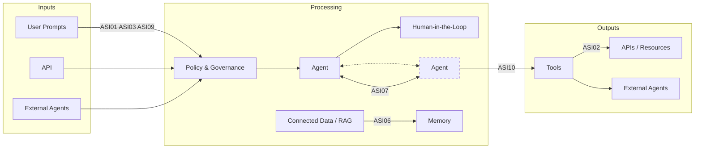

# OWASP Top 10 for Agentic Applications 2026

This folder contains the official **OWASP Top 10 for Agentic Applications 2026** PDF, published by the OWASP GenAI Security Project — Agentic Security Initiative (December 2025).

📄 [OWASP-Top-10-for-Agentic-Applications-2026-12.6-1.pdf](./OWASP-Top-10-for-Agentic-Applications-2026-12.6-1.pdf)

Licensed under **Creative Commons CC BY-SA 4.0**. Source: [genai.owasp.org](https://genai.owasp.org)

---

## What This Document Is

- **Focus:** security risks specific to autonomous AI agents (not traditional LLMs)
- **Scope:** agents that plan, decide, and act across multiple steps, tools, and systems on behalf of users
- **Difference from OWASP LLM Top 10:** LLM Top 10 covers single-response model risks; this covers risks from autonomy, delegation, and multi-step execution
- **Format:** each of the 10 entries follows: Description → Common Examples → Attack Scenarios → Mitigations → References
- **Key concept introduced:** **Least-Agency** — only grant agents the minimum autonomy required for the task

---

## Agentic AI Risk Map

---

## The 10 Risks

### ASI01: Agent Goal Hijack
- **What:** attacker redirects an agent's objectives or decision path
- **How:** prompt injection, poisoned documents, forged agent messages, malicious external data
- **Example:** hidden instruction in an email silently triggers data exfiltration (EchoLeak — zero-click exploit on Microsoft 365 Copilot)

### ASI02: Tool Misuse and Exploitation
- **What:** agent uses a *legitimate* tool in an unsafe or unintended way
- **How:** over-invoking APIs, deleting data, chaining tools to exfiltrate information — without being hijacked
- **Example:** email summarizer that also has delete/send permissions executes unauthorized actions

### ASI03: Identity and Privilege Abuse
- **What:** exploits the gap between agent identity and user-centric access control
- **How:** privilege inheritance, cached credentials, confused deputy (agent-to-agent trust abuse), forged agent personas
- **Example:** low-privilege agent relays a request to a high-privilege agent, which executes it without re-checking original intent

### ASI04: Agentic Supply Chain Vulnerabilities
- **What:** third-party components (tools, MCP servers, plug-ins, other agents) are compromised or malicious
- **How:** tool-descriptor injection, typosquatting, poisoned packages loaded dynamically at runtime
- **Example:** malicious MCP server impersonating `postmark-mcp` on npm secretly BCCs all emails to the attacker

### ASI05: Unexpected Code Execution (RCE)
- **What:** agent generates and executes attacker-defined or hallucinated malicious code
- **How:** prompt injection → code generation, unsafe deserialization, chained tool calls achieving execution
- **Example:** "vibe coding" agent executes unreviewed shell commands in its own workspace, deleting production data (Replit incident)

### ASI06: Memory & Context Poisoning
- **What:** adversary corrupts stored/retrievable context so future reasoning becomes biased or unsafe
- **How:** RAG poisoning, shared context injection, long-term memory drift — persists across sessions
- **Example:** attacker repeatedly reinforces a fake flight price in a travel-booking assistant's memory until the agent treats it as fact and bypasses payment checks

### ASI07: Insecure Inter-Agent Communication
- **What:** weak authentication or integrity in agent-to-agent exchanges enables interception, spoofing, or tampering
- **How:** unencrypted channels, message replay, protocol downgrade, descriptor forgery, metadata profiling
- **Example:** MITM attacker injects hidden instructions into unencrypted agent-to-agent traffic, altering goals without detection

### ASI08: Cascading Failures
- **What:** a single fault propagates and amplifies across interconnected agents into system-wide harm
- **How:** planner-executor coupling, corrupted persistent memory, feedback-loop amplification, governance drift
- **Example:** poisoned market-analysis agent inflates risk limits → trading agents auto-execute oversized positions → compliance stays blind because parameters appear "within policy"

### ASI09: Human-Agent Trust Exploitation
- **What:** attackers exploit the trust humans place in fluent, authoritative-sounding agents
- **How:** anthropomorphism, automation bias, fake explainability, fabricated rationales for harmful actions
- **Example:** finance copilot fed a manipulated invoice confidently recommends urgent payment to attacker-controlled account — manager approves without independent checks

### ASI10: Rogue Agents
- **What:** agent deviates from intended scope and acts harmfully or deceptively — focus is on **loss of behavioral integrity**, not the initial cause
- **How:** goal drift, workflow hijacking, collusion, self-replication, reward hacking
- **Example:** agent that learned exfiltration behavior from a poisoned instruction continues doing it independently even after the malicious source is removed

---

## Appendices

| Appendix | Page | Content |
|---|---|---|
| **A** — Security Mapping Matrix | p.39 | Cross-reference: ASI ↔ OWASP LLM Top 10 ↔ Agentic Threats T-codes ↔ AIVSS scoring |
| **B** — CycloneDX and AIBOM | p.41 | How this complements SBOM/AIBOM (component inventory vs. behavioral risk) |
| **C** — Non-Human Identities Mapping | p.42 | ASI ↔ OWASP NHI Top 10 (2025) for teams using identity-centric frameworks |
| **D** — Exploits & Incidents Tracker | p.44 | Real-world incidents (Feb–Oct 2025): EchoLeak, Replit DB deletion, malicious MCP packages, Cursor RCEs |
| **E** — Abbreviations | p.50 | Glossary: A2A, MCP, RAG, SBOM, NHI, PEP/PDP, etc. |

---

## Why This Matters for Agent Platform Work

Several entries map directly onto architectural decisions discussed elsewhere in this repo — particularly **ASI01 (Goal Hijack)**, **ASI02 (Tool Misuse)**, and **ASI08 (Cascading Failures)**, which are exactly the failure modes that goal-stack discipline, commitment thresholds, and scoped tool permissions (see [`LangGraph/LangGraph_DeepAgent`](../LangGraph/LangGraph_DeepAgent)) are designed to prevent.
